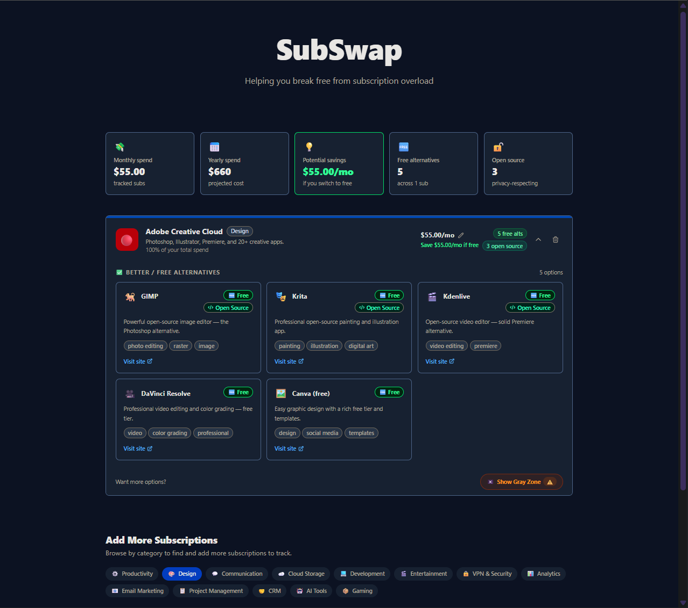

# SubSwap

SubSwap is a polished React + Vite dashboard that helps you compare subscription services, track monthly spend, and discover lower-cost or free alternatives.

## Screenshot



## Features

- Add subscriptions from curated categories.
- Track monthly spend across all selected services.
- Filter active subscriptions by category.
- See counts for free alternative services and open-source alternatives.
- Browse more subscriptions and add them with a single click.
- Use the Gray Zone explorer for deeper alternative discovery.
- Stores your selections locally in the browser using local storage.

## Built With

- React 19
- Vite 7
- Tailwind CSS 4
- TypeScript
- Framer Motion
- Fuse.js

## Screenshot


## Getting Started

### Prerequisites

- Node.js 20+ recommended

### Install

```bash
npm install
```

### Run locally

```bash
npm run dev
```

### Build for production

```bash
npm run build
```

### Preview production build

```bash
npm run preview
```

## Project Structure

- `src/App.tsx` — main dashboard and browsing experience
- `src/components/` — UI cards, filters, stats, and modal components
- `src/data/` — subscription data, categories, and alternative listings
- `src/hooks/` — local storage hook
- `src/types.ts` — shared TypeScript types

## License

This project has no license information provided.
